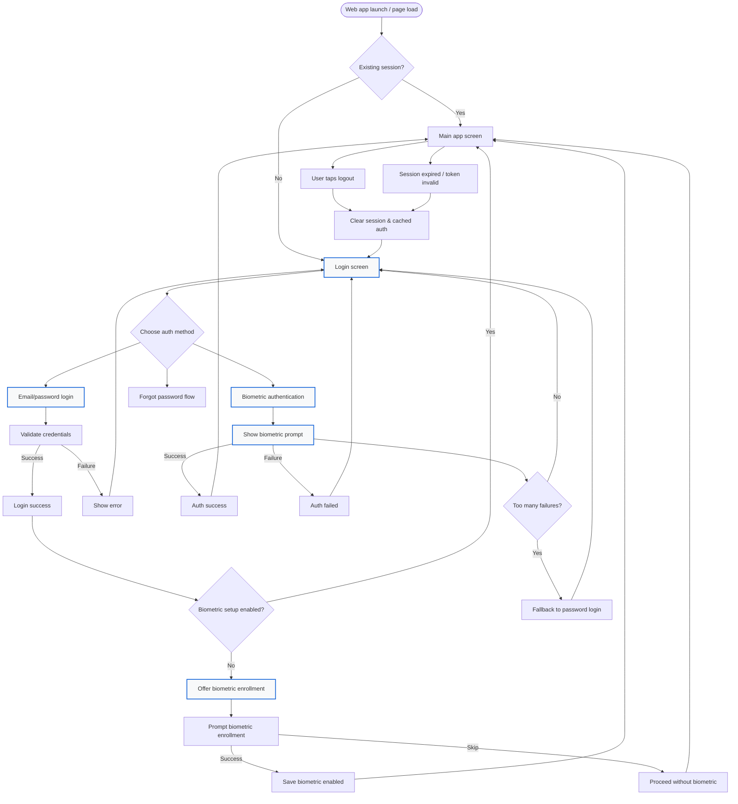

# Web App Login / Logout / Biometric Auth Workflow

## Notes
- Use secure cookies or secure client-side storage for tokens/refresh tokens and a safe enrollment flag for biometric login.
- In a web-first architecture, handle biometric prompt on the client using WebAuthn or platform-specific browser/mobile support; backend should support token refresh and biometric-enabled login state.
- On successful email/password login, optionally offer biometric enrollment for faster future access.
- Logout should clear session state, revoke tokens, and return the user to the login screen.
- Handle session expiration and biometric lockout by returning to the login screen with a fallback to credentials.
